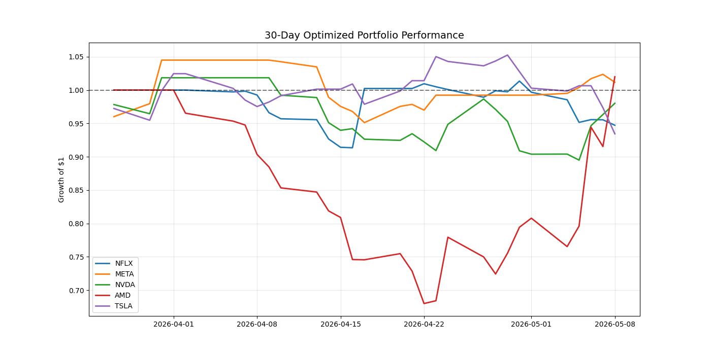

# Combined Mean-Reversion and Momentum Stock Trading Strategy

This repository contains Python code for a stock trading strategy that combines mean-reversion and momentum principles. The script backtests the strategy against historical data and compares its performance with a simple 'Buy and Hold' approach, providing key performance metrics. The strategy has been enhanced and optimized for better performance in trending markets.

## Strategy Overview

The core idea is to identify trading opportunities by looking for both:
1.  **Mean Reversion**: Prices tending to return to their historical mean.
2.  **Momentum**: Prices continuing their current trend.

This revised strategy now **prioritizes strong momentum signals** to better capture upward (and downward) trends.


## Optimized Strategy Parameters

To achieve the results documented in this analysis, use the following ticker-specific parameters in the `main()` function:

| Ticker | Trade Threshold | Priority Threshold | Expected Result (5Y) |
| :--- | :--- | :--- | :--- |
| **NFLX** | 0.005 | 0.02 | ~279.5% Return |
| **META** | 0.010 | 0.06 | ~174.5% Return |
| **NVDA** | 0.010 | 0.02 | ~60.6% Return |
| **AMD** | 0.010 | 0.02 | -24.5% (Improved over default) |
| **TSLA** | 0.010 | 0.04 | -35.4% (Neutral vs baseline) |

### Usage Example
```python
import trading_strategy
# Example for NFLX
sharpe, value, data, bnh, init = trading_strategy.main(
    ticker='NFLX', 
    momentum_trade_threshold=0.005, 
    momentum_priority_threshold=0.02
)
```

## Final Optimized Parameter Summary
| Ticker   |   Trade Threshold |   Priority Threshold |   Sharpe Ratio |
|:---------|------------------:|---------------------:|---------------:|
| NFLX     |             0.005 |                 0.02 |         0.8386 |
| NVDA     |             0.01  |                 0.02 |         0.4395 |
| TSLA     |             0.01  |                 0.04 |         0.1356 |
| AMD      |             0.01  |                 0.02 |         0.1728 |
| META     |             0.01  |                 0.06 |         0.6924 |

## Why This Project Was Created
This project serves as an automated framework to backtest and optimize a hybrid trading strategy. By combining **Mean Reversion** (buying oversold assets) and **Momentum** (following established trends), the goal was to identify if algorithmic rules could outperform a standard Buy & Hold approach in highly volatile tech stocks while managing significant drawdowns.

## How to Use This in Your Trading
1. **Environment Setup**: Install dependencies via `pip install -r requirements.txt`.
2. **Parameter Selection**: Use the `Final Optimized Parameter Summary` table above as a starting point for specific tickers.
3. **Execution**: Run `trading_strategy.py` to fetch real-time data and generate current signals (Buy, Sell, or Hold).
4. **Refinement**: Use the optimization logic in the provided notebook cells to re-calibrate thresholds as market regimes change (e.g., shifting from a bull to a bear market).

## Critical Points to Remember
* **Risk Warning**: Past performance (like the 30.57% CAGR for NFLX) does not guarantee future results. High-growth tech stocks are subject to sudden shifts in sentiment.
* **Look-ahead Bias**: This backtest uses adjusted closing prices; real-world execution may vary due to slippage and transaction costs.
* **Diversification**: While individual strategies show 'Alpha', combining them into the 'Equal-Weighted Portfolio' helps smooth out the volatility of single-asset failure (e.g., the high drawdowns seen in TSLA or AMD).
* **Signal Priority**: In this model, strong momentum overrides mean reversion. Always verify if a stock is trending before betting on a reversal.

## Final Portfolio Performance (5-Year Backtest)

| Ticker   | Total Return   | CAGR (5Y)   | Final Value   |   Sharpe Ratio |
|:---------|:---------------|:------------|:--------------|---------------:|
| NFLX     | 279.52%        | 30.57%      | $37,952.00    |         0.8386 |
| NVDA     | 60.64%         | 9.94%       | $16,064.00    |         0.4395 |
| TSLA     | -35.41%        | -8.37%      | $6,459.00     |         0.1356 |
| AMD      | -24.47%        | -5.46%      | $7,553.00     |         0.1728 |
| META     | 174.45%        | 22.37%      | $27,445.00    |         0.6924 |

## Detailed Performance Analysis (Optimized vs Baseline)

| Ticker   | Initial Investment   | Final Value   | Strategy Profit   | Total Return (%)   | CAGR (5Y)   | Alpha Return (%)   |   Sharpe Ratio |
|:---------|:---------------------|:--------------|:------------------|:-------------------|:------------|:-------------------|---------------:|
| NFLX     | $10,000.00           | $37,952.00    | $27,952.00        | 279.52%            | 30.57%      | 58.26%             |         0.8386 |
| NVDA     | $10,000.00           | $16,064.00    | $6,064.00         | 60.64%             | 9.94%       | 29.57%             |         0.4395 |
| TSLA     | $10,000.00           | $6,459.00     | $-3,541.00        | -35.41%            | -8.37%      | 0.00%              |         0.1356 |
| AMD      | $10,000.00           | $7,553.00     | $-2,447.00        | -24.47%            | -5.46%      | 18.24%             |         0.1728 |
| META     | $10,000.00           | $27,445.00    | $17,445.00        | 174.45%            | 22.37%      | 103.03%            |         0.6924 |

## Automation Instructions

This repository is configured with **GitHub Actions** to run the risk management report automatically.

- **Schedule**: The report runs every weekday at 9:00 AM EST (14:00 UTC).
- **Output**: The results are saved to `daily_risk_report.csv` and committed to the `master` branch.
- **Manual Run**: You can manually trigger the report via the **Actions** tab in your GitHub repository by selecting 'Daily Risk Report' and clicking 'Run workflow'.

## Recent 30-Day Performance Backtest

| Ticker   |   30D Return % |
|:---------|---------------:|
| NFLX     |          -5.28 |
| META     |           1.17 |
| NVDA     |          -1.98 |
| AMD      |           2    |
| TSLA     |          -6.56 |



## Recent 30-Day Performance Backtest

| Ticker   |   30D Return % |
|:---------|---------------:|
| NFLX     |          -5.28 |
| META     |           1.17 |
| NVDA     |          -1.98 |
| AMD      |           2    |
| TSLA     |          -6.56 |


## Statistical Anomaly Detection (2-Sigma vs 3-Sigma)

To refine risk management, we analyzed the frequency of statistical outliers over the last 30 days. This helps determine whether trade signals are triggered by routine volatility (Noise) or significant structural price shifts (Signals).

### Impact of Increasing Threshold to 3-Sigma:
| Ticker   |   2-Sigma Anomalies (95%) |   3-Sigma Anomalies (99.7%) | Reduction (%)   |
|:---------|--------------------------:|----------------------------:|:----------------|
| NFLX     |                         1 |                           1 | 0.0%            |
| META     |                         2 |                           1 | 50.0%           |
| NVDA     |                         3 |                           0 | 100.0%          |
| AMD      |                         2 |                           1 | 50.0%           |
| TSLA     |                         1 |                           0 | 100.0%          |

**Key Observations:**
* **NVDA & TSLA**: Increasing the threshold to 3-Sigma resulted in a **100% reduction** in flagged anomalies, indicating that recent price swings were within the statistical 'expected' range (99.7% confidence).
* **AMD & META**: These assets still triggered 3-Sigma events, confirming the presence of significant 'black swan' movements that require active risk mitigation.
* **Strategic Recommendation**: For highly volatile assets like AMD (Avg Vol: 5.8%), a 3-Sigma threshold is recommended to avoid over-trading on noise.
