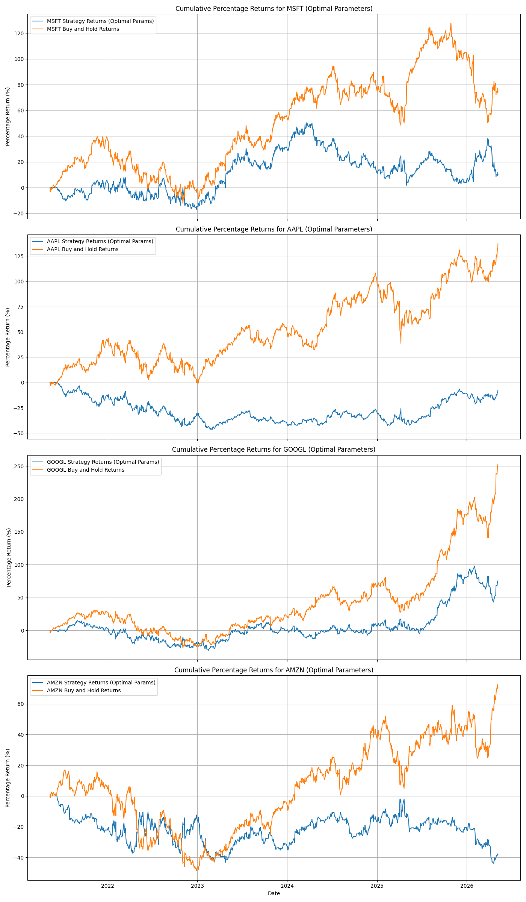
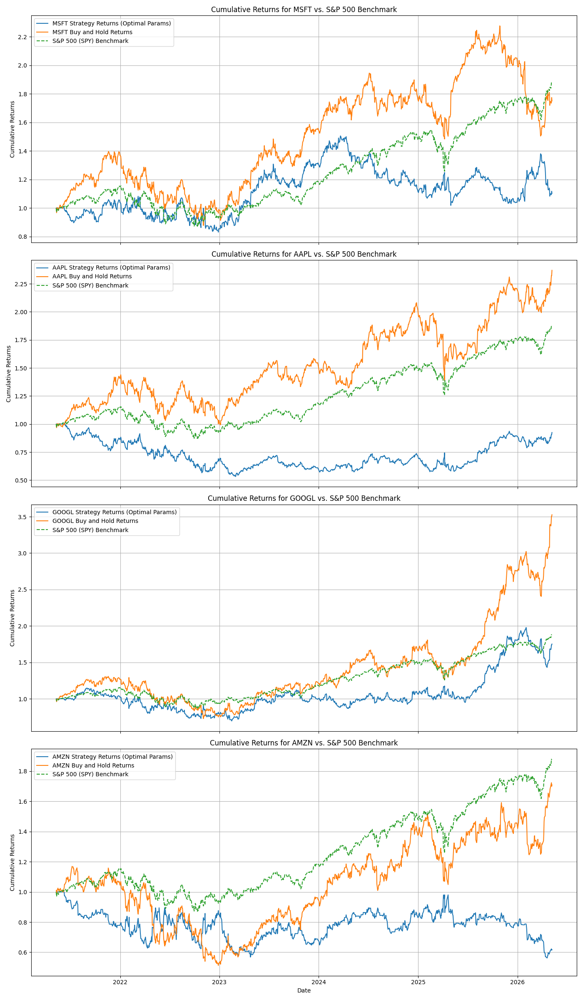
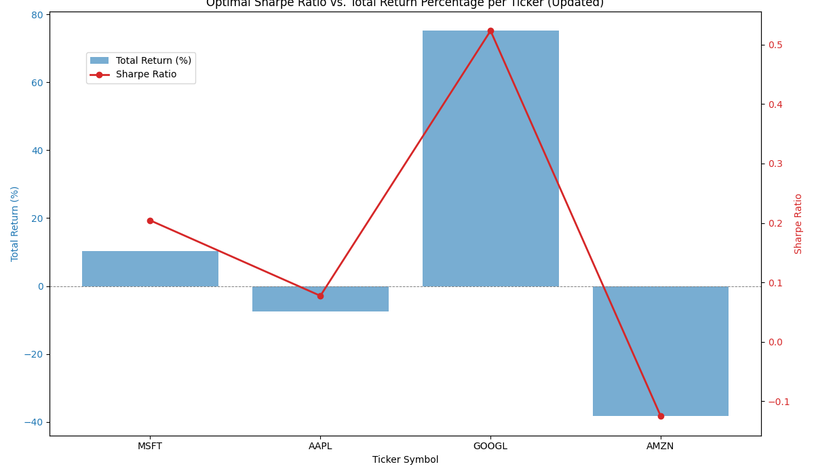
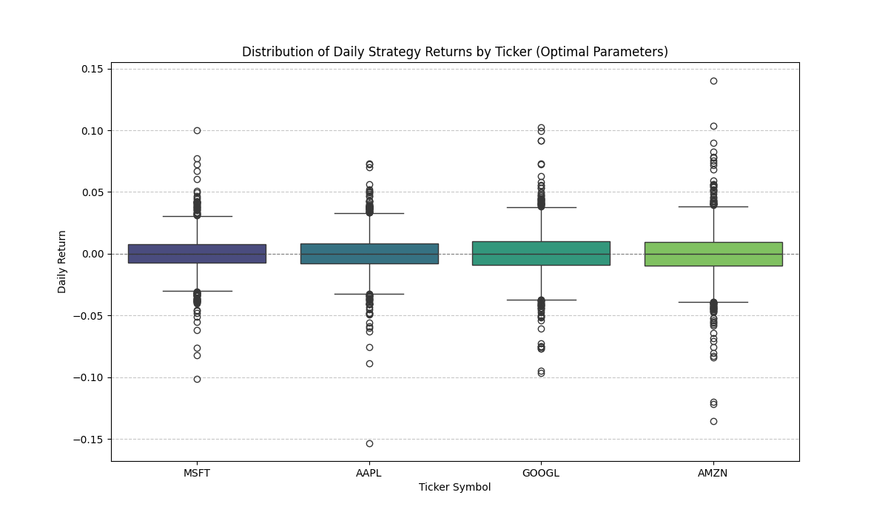
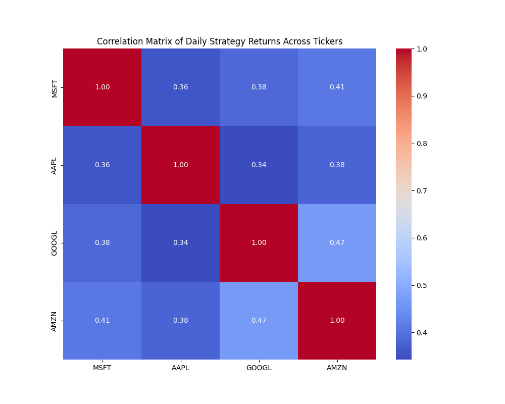
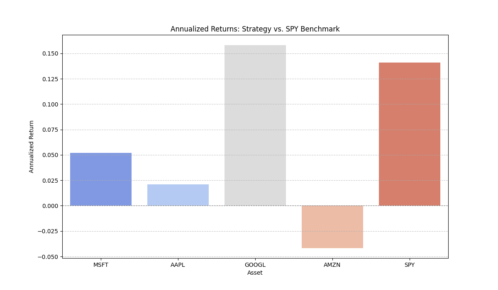
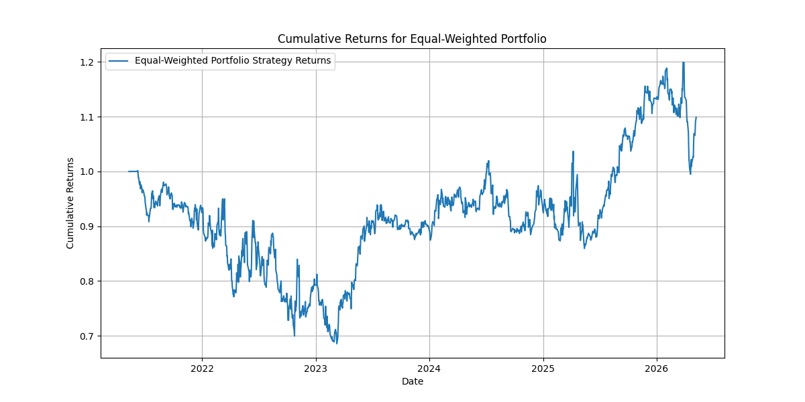

# Combined Mean-Reversion and Momentum Stock Trading Strategy

This repository contains Python code for a stock trading strategy that combines mean-reversion and momentum principles. The script backtests the strategy against historical data and compares its performance with a simple 'Buy and Hold' approach, providing key performance metrics. The strategy has been enhanced and optimized for better performance in trending markets.

## Strategy Overview

The core idea is to identify trading opportunities by looking for both:
1.  **Mean Reversion**: Prices tending to return to their historical average.
2.  **Momentum**: Prices continuing their current trend.

This revised strategy now **prioritizes strong momentum signals** to better capture upward (and downward) trends.

## Components

### 1. Data Fetching
-   Uses the `yfinance` library to download historical stock data for a specified period (default: 5 years).

### 2. Mean-Reversion Strategy
-   **Concept**: Assumes stock prices will revert to their historical mean.
-   **Mechanism**: Calculates a 20-day Simple Moving Average (SMA) and a Z-score of the `Close` price relative to this SMA.
-   **Trading Logic**: Buys if Z-score is < -1, Sells if Z-score > 1, else Holds.

### 3. Momentum Strategy (Enhanced for Trend Following)
-   **Concept**: Assumes that existing trends tend to continue, with an emphasis on significant trends.
-   **Mechanism**: Calculates the **50-day** percentage change in the `Close` price.
-   **Trading Logic**: Buys if momentum > `momentum_trade_threshold`, Sells if momentum < `-momentum_trade_threshold`, else Holds.

### 4. Combining Strategies (Momentum-Prioritized & Optimized)
-   The signals from both mean-reversion and momentum strategies are aggregated.
-   **Logic**: If a strong momentum signal (above `momentum_priority_threshold`) is present, it **overrides** any mean-reversion signal. Otherwise, the strategy defers to the mean-reversion signal.
-   **Optimization**: The `momentum_trade_threshold` and `momentum_priority_threshold` parameters were optimized across multiple tickers (`MSFT`, `AAPL`, `GOOGL`, `AMZN`) to maximize Sharpe Ratio.

### 5. Backtesting
-   Simulates the strategy's performance on historical data.
-   Calculates `strategy_returns` based on daily stock returns and the lagged `combined_position`.
-   Computes `cumulative_returns` to visualize portfolio growth.

## Performance Metrics & Analysis

The script calculates and displays the following metrics for both the custom strategy and a 'Buy and Hold' benchmark, across all analyzed tickers:

-   **Investment Period**: The date range over which the backtest was conducted.
-   **Initial Investment**: The starting capital.
-   **Final Value**: The portfolio value at the end of the backtest.
-   **Profit/Loss**: The absolute gain or loss.
-   **Sharpe Ratio**: A risk-adjusted return measure (higher is better).
-   **Maximum Drawdown**: The largest percentage drop from a peak to a trough in the portfolio value.
-   **Win Rate**: The percentage of trading days where the strategy generated a positive return.
-   **Average Daily & Annualized Returns**: For individual tickers and the S&P 500 (SPY) benchmark.
-   **Portfolio Annualized Return**: For an equal-weighted portfolio of the analyzed tickers.

## Optimization Results (Example for MSFT):
During the optimization process, we iterated through various `momentum_trade_threshold` and `momentum_priority_threshold` values to find the combination that yielded the highest Sharpe Ratio for each ticker.

| Ticker | Optimal Momentum Trade Threshold | Optimal Momentum Priority Threshold | Optimal Sharpe Ratio |
|---|---|---|---|
| MSFT | 0.005 | 0.020 | 0.2043 |
| AAPL | 0.005 | 0.010 | 0.0774 |
| GOOGL | 0.005 | 0.020 | 0.5235 |
| AMZN | 0.005 | 0.050 | -0.1253 |

## Visualizations

The repository includes several plots to analyze the strategy's performance:

1.  **Cumulative Percentage Returns for Each Ticker**: Compares the strategy's performance against a 'Buy and Hold' approach and the S&P 500 (SPY) benchmark.
    
    

2.  **Optimal Sharpe Ratio vs. Total Return Percentage**: Visualizes the trade-off between risk-adjusted return and total profit for each ticker.
    

3.  **Distribution of Daily Strategy Returns (Box Plot)**: Shows the volatility and spread of daily returns for each ticker's optimized strategy.
    

4.  **Correlation Matrix of Daily Strategy Returns**: A heatmap showing the correlation between the daily returns of the optimized strategies for different tickers.
    

5.  **Annualized Returns: Strategy vs. SPY Benchmark**: Bar chart comparing the annualized returns of individual ticker strategies with the S&P 500.
    

6.  **Cumulative Returns for Equal-Weighted Portfolio**: Shows the growth of an equally weighted portfolio composed of the optimized strategies.
    

## How to Use

1.  **Run the script**: Execute the Python code in your environment.
2.  **Adjust Parameters**: Modify the `ticker`, `start_date`, `end_date`, `momentum_window`, `momentum_trade_threshold`, and `momentum_priority_threshold` parameters directly in the `main()` function's call in `trading_strategy.py` or through the optimization cell to test different assets or periods.
3.  **Analyze Results**: Review the printed performance metrics and the generated plots to evaluate the strategy.

---

**Note**: This is a simplified trading strategy for educational purposes. Real-world trading involves significant risks and requires more sophisticated analysis, risk management, and consideration of transaction costs, liquidity, and other factors. Past performance is not indicative of future results.
