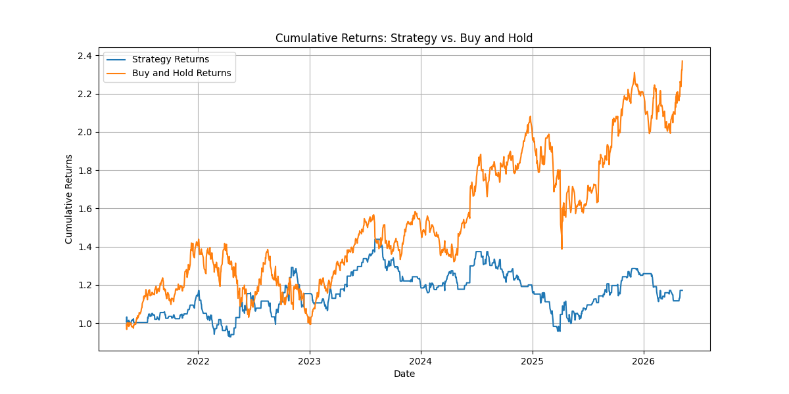

# Combined Mean-Reversion and Momentum Stock Trading Strategy

This repository contains Python code for a stock trading strategy that combines mean-reversion and momentum principles. The script backtests the strategy against historical data and compares its performance with a simple 'Buy and Hold' approach, providing key performance metrics.

## Strategy Overview

The core idea is to identify trading opportunities by looking for both:
1.  **Mean Reversion**: Prices tending to return to their historical average.
2.  **Momentum**: Prices continuing their current trend.

The strategy combines signals from both approaches to generate a final trading decision.

## Components

### 1. Data Fetching
-   Uses the `yfinance` library to download historical stock data (e.g., AAPL) for a specified period (default: 5 years).

### 2. Mean-Reversion Strategy
-   **Concept**: Assumes stock prices will revert to their historical mean.
-   **Mechanism**: Calculates a 20-day Simple Moving Average (SMA) and a Z-score of the `Close` price relative to this SMA.
-   **Trading Logic**:
    -   **Buy Signal**: If the Z-score is significantly negative (price is well below its mean), indicating a potential rebound.
    -   **Sell Signal**: If the Z-score is significantly positive (price is well above its mean), indicating a potential pull-back.

### 3. Momentum Strategy
-   **Concept**: Assumes that existing trends tend to continue.
-   **Mechanism**: Calculates the 20-day percentage change in the `Close` price.
-   **Trading Logic**:
    -   **Buy Signal**: If the 20-day momentum is positive, indicating an upward trend.
    -   **Sell Signal**: If the 20-day momentum is negative, indicating a downward trend.

### 4. Combining Strategies
-   The signals from both mean-reversion and momentum strategies are aggregated.
-   A final `combined_position` is determined (Buy, Sell, or Hold) based on the consensus or average of the two individual strategy signals.

### 5. Backtesting
-   Simulates the strategy's performance on historical data.
-   Calculates `strategy_returns` based on daily stock returns and the lagged `combined_position` (to reflect trades executed based on the previous day's signal).
-   Computes `cumulative_returns` to visualize portfolio growth.

## Performance Metrics

The script calculates and displays the following metrics for both the custom strategy and a 'Buy and Hold' benchmark:

-   **Investment Period**: The date range over which the backtest was conducted.
-   **Initial Investment**: The starting capital.
-   **Final Value**: The portfolio value at the end of the backtest.
-   **Profit/Loss**: The absolute gain or loss.
-   **Sharpe Ratio**: A risk-adjusted return measure (higher is better).
-   **Maximum Drawdown**: The largest percentage drop from a peak to a trough in the portfolio value, indicating potential risk.
-   **Win Rate**: The percentage of trading days where the strategy generated a positive return.

## Cumulative Returns Plot

Here's a visualization of the strategy's cumulative returns compared to a 'Buy and Hold' approach:

## How to Use

1.  **Run the script**: Execute the Python code in your environment.
2.  **Adjust Parameters**: Modify the `ticker`, `start_date`, `end_date`, or strategy `window` parameters in the `main()` function to test different assets or periods.
3.  **Analyze Results**: Review the printed performance metrics and the cumulative returns plot to evaluate the strategy.

---

**Note**: This is a simplified trading strategy for educational purposes. Real-world trading involves significant risks and requires more sophisticated analysis, risk management, and consideration of transaction costs, liquidity, and other factors. Past performance is not indicative of future results.
